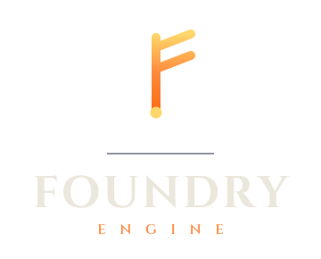

# Foundry

> **Foundry is a fork of Godot Engine 4.6.3 (MIT).** See [NOTICE](NOTICE) and [LICENSE.txt](LICENSE.txt) for attribution and license details.

<p align="center">
  <a href="https://godotengine.org">
    
  </a>
</p>

Foundry is a fork of the [Godot Engine](https://godotengine.org)
focused on a stronger, statically-typed scripting experience and richer editor
tooling for writing code. It keeps everything that makes Godot a great
cross-platform 2D and 3D game engine, and layers on a new scripting language —
**Foundry Script** — derived from GDScript but extended with modern language
features and first-class refactoring support.

## ⚠️ Experimental

This is an experiment to see how far the Godot Engine can be pushed in a few
specific directions: a more type-safe scripting language, better editor tooling
for scripting, and language features that aren't present in stock GDScript.

A large amount of the implementation is being done with AI assistance (primarily
Claude and Codex). This is primarily a personal project built around my own
tastes for what the language and tooling should look like. It may be useful to
others, or it may not be. **Support, stability, and backwards compatibility are
not guaranteed** — treat it as experimental and don't ship production games on
it without understanding that caveat. Published builds are available from
[Foundry releases](https://github.com/cafecito-games/Foundry/releases) for
anyone who wants to try them out.

## Foundry Script

Foundry Script is a superset-flavored evolution of GDScript. It uses the `.fs`
file extension (compiled `.fsc`) and is implemented in
[`modules/foundry_script/`](modules/foundry_script/). Beyond everything GDScript
already offers, it adds:

- **Stricter static typing** — opt-in stricter analysis (including null and
  dynamic-cast checks) to catch type errors at compile time instead of at
  runtime.
- **Generics** — type parameters with optional bounds on both classes and
  functions, e.g. `class Pair[K, V: RefCounted]` and `func swap[T]()`, with type
  arguments at use sites.
- **Traits** — mixin-style, composable units of behavior. Classes compose one or
  more traits with `uses`, traits can inherit from other traits, and traits can
  themselves be generic.
- **`final`** — mark a class or method `final` to forbid further
  inheritance/overriding.
- **`abstract`** — mark a class `abstract` to forbid direct instantiation, and
  methods `abstract` to require subclasses to implement them.
- **Top-level enums** — file-scope enums declared with `enum_name`, usable as
  globals rather than only as inner enums.
- **`async` coroutines** — declare coroutine functions with the `async` keyword,
  plus an `AsyncCallable` type for typing callables that return coroutines.
- **Namespaces** — declare a file `namespace` and `import` others for
  hierarchical organization and name-conflict avoidance, with namespace-qualified
  classes and enums.

## Editor & IDE tooling

Foundry invests heavily in the experience of writing and maintaining scripts,
through both the editor and a Language Server (LSP) usable from external IDEs.

- **Refactoring** — a suite of safe, analyzer-backed refactors: rename
  (including cross-file), extract variable, extract method, inline variable, add
  type annotation, implement abstract methods, insert explicit cast, widen to
  nullable, and sort members by the style guide.
- **Language Server (LSP)** — completion, go-to-definition, find-references, and
  hover, exposed over LSP so editors beyond the Godot editor can integrate.
- **Code formatter** — a full formatter that rewrites source to a canonical
  style while preserving comments and literals (and refusing to format on parse
  errors).
- **Strict-typing migration wizard** — an editor tool to help migrate untyped
  code toward stricter type annotations.
- **Syntax highlighting & doc generation** — Foundry Script-aware highlighting in
  the editor and documentation generation from script comments.

## Getting the engine

### Compiling from source

Foundry builds the same way as Godot. For example, on macOS:

```sh
scons platform=macos target=editor dev_build=yes tests=yes
```

Use `platform=linuxbsd` on Linux or `platform=windows` on Windows. See the
[official Godot docs](https://docs.godotengine.org/en/latest/engine_details/development/compiling)
for platform-specific prerequisites and options, and [CONTRIBUTING.md](CONTRIBUTING.md)
for repository conventions.

### Binary downloads

Published editor binaries and export templates are available from the
[Foundry releases](https://github.com/cafecito-games/Foundry/releases).

### Headless container

Published releases are also available at `ghcr.io/cafecito-games/foundry` as a
minimal `linux/amd64` image for Foundry Script tooling and project-owned test
runners:

```sh
docker pull ghcr.io/cafecito-games/foundry:v0.1.0-alpha.9
```

Every image has an exact tag matching its Git release tag, including the leading
`v`. Moving tags are channel-specific: `latest-alpha`, `latest-beta`, and
`latest-rc` track prereleases, while `latest` tracks stable releases only.

The image automatically passes `--headless` to Foundry and uses `/workspace` as
its working directory:

```sh
docker run --rm \
  -v "$PWD:/workspace" \
  ghcr.io/cafecito-games/foundry:latest-alpha \
  script lint .

docker run --rm \
  -v "$PWD:/workspace" \
  ghcr.io/cafecito-games/foundry:latest-alpha \
  project test --project . --runner res://tests/runner.fs

docker run --rm \
  ghcr.io/cafecito-games/foundry:latest-alpha \
  script eval 'print("ok")'
```

The container runs as the non-root UID/GID `10001:10001`. Read-only commands
work with readable bind mounts (for example, use `:ro` for linting). Commands
that rewrite files require a writable bind mount. On a host whose checkout has
a different owner, run mutating commands with the host UID/GID and a temporary
writable home:

```sh
docker run --rm \
  --user "$(id -u):$(id -g)" \
  -e HOME=/tmp/foundry-home \
  -v "$PWD:/workspace" \
  ghcr.io/cafecito-games/foundry:latest-alpha \
  script format --write .
```

The initial image is `linux/amd64` only and contains Foundry plus its runtime
libraries, not export templates, compilers, Git, or the internal engine test
suite. The GHCR package is intended to be public. After its first publication,
verify anonymous access from a shell that is not authenticated to GHCR:

```sh
docker pull ghcr.io/cafecito-games/foundry:v0.1.0-alpha.9
```

If the pull fails, an organization administrator must switch the package
visibility to Public in GitHub Packages.

## About Godot

Foundry is built on **[Godot Engine](https://godotengine.org)**, a feature-packed,
cross-platform engine for creating 2D and 3D games from a unified interface. It
provides a comprehensive set of [common tools](https://godotengine.org/features)
and one-click export to desktop (Linux, macOS, Windows), mobile (Android, iOS),
Web, and [consoles](https://godotengine.org/consoles).

Godot is free and open source under the permissive
[MIT license](https://godotengine.org/license) — no strings attached, no
royalties. Its development is independent and community-driven, supported by the
[Godot Foundation](https://godot.foundation/). Before being open sourced in
[February 2014](https://github.com/godotengine/godot/commit/0b806ee0fc9097fa7bda7ac0109191c9c5e0a1ac),
Godot was developed by [Juan Linietsky](https://github.com/reduz) and
[Ariel Manzur](https://github.com/punto-) as an in-house engine.


## Godot documentation and resources

The upstream Godot resources remain the best reference for engine features that
Foundry inherits:

- The official documentation is hosted on [Read the Docs](https://docs.godotengine.org).
  The [class reference](https://docs.godotengine.org/en/latest/classes/) is also
  accessible from within the editor.
- Official demos live in their own [GitHub repository](https://github.com/godotengine/godot-demo-projects),
  alongside a list of [awesome Godot community resources](https://github.com/godotengine/awesome-godot).
- Additional community [learning resources](https://docs.godotengine.org/en/latest/community/tutorials.html)
  (text and video tutorials, demos, etc.) are available through the
  [community channels](https://godotengine.org/community).
